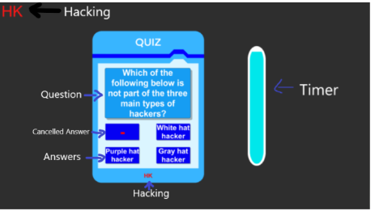

Here’s the updated README file with a game flow summary and instructions for adding images:

---

# Control-Alt-Hack 2.0

Control-Alt-Hack 2.0 is an engaging desktop educational application designed to teach cybersecurity concepts.  
The game features interactive quizzes and challenges aimed at helping users understand essential security principles.  
In a survey, 40% of testers found the game educational and enjoyable.

---

## Game Flow

1. **Home Screen**  
   Players are greeted with the main menu featuring options to Play, view Rules, access Settings, or Quit the game.  
   

2. **Game Lobby**  
   Players can change their username, create a room, or join an existing room by entering a server name.  
   

3. **Choose Character**  
   Players roll a dice to be assigned a character specializing in Cloud Computing, Data Management, or Hacking.  
   

4. **First Mission: Quiz Challenge**  
   Players answer cybersecurity-related questions. Characters with relevant specializations have an advantage.  
   

5. **Second Mission: Maze Escape**  
   Players navigate through two maze stages with obstacles, enemies, and puzzles to escape.  
     
     
   

6. **Third Mission: Match the Code**  
   Players learn Java programming concepts through interactive lecture screens and then match missing code in a limited time.  
   

7. **Winning Screen**  
   Players with the highest score receive a certificate of recognition. Those who lose will see the losing screen.
   
---

## How to Play

1. **Download** the zip file from the provided link.  
2. **Extract** all files to your desired location.  
3. Open the **GAME** folder.  
4. Double-click the **Control-Alt-Hack 2.0** executable/application file.  
5. Enjoy the game!

---

## How to Import Unity Package File

The Unity Package File for this game is available for those who wish to explore the inner workings of the game using the Unity Editor.

1. Open your **Unity Project**.  
2. Drag and drop the Unity package file into the **Assets** folder in Unity.  
3. When the import window pops up, click **Import**.  

---
